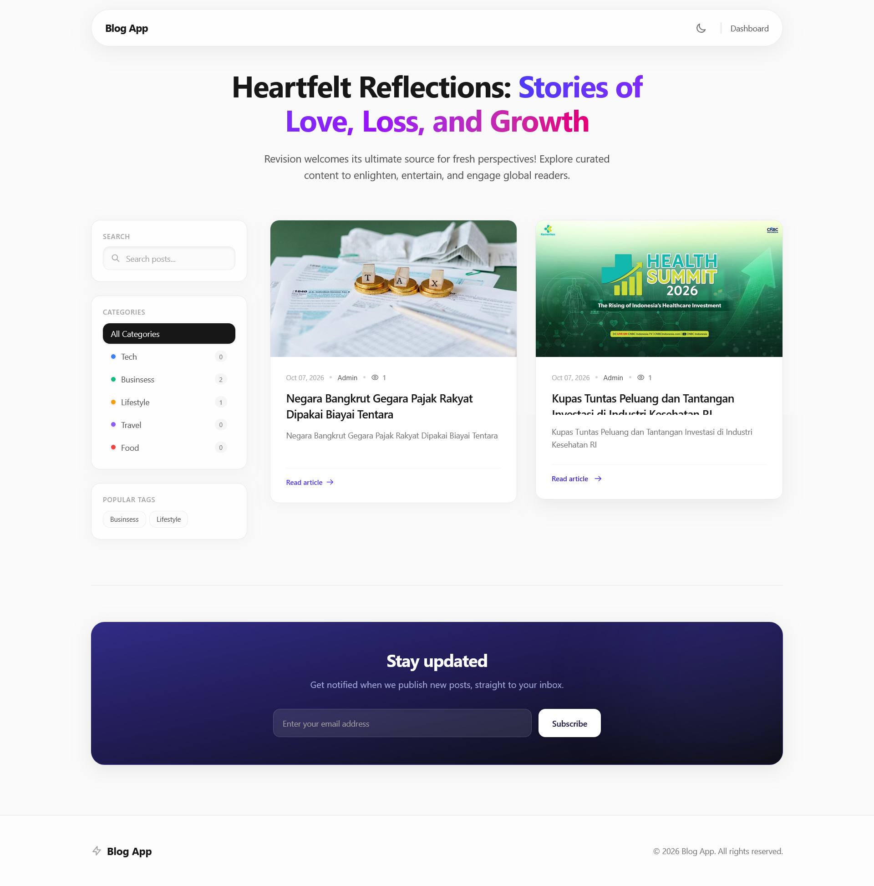
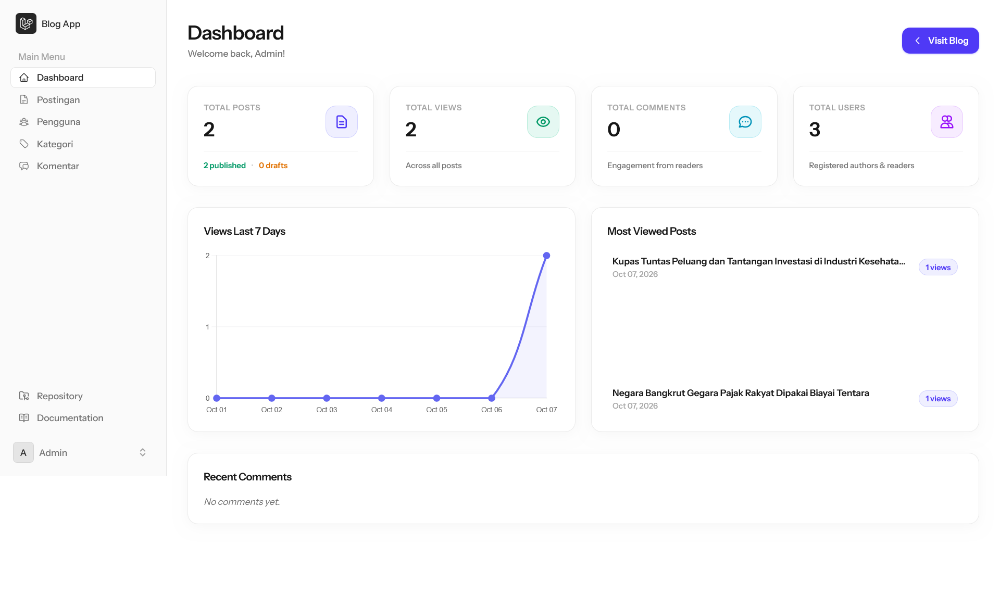

# 🚀 Modern Livewire Blog Application

Aplikasi web blog _full-stack_ modern yang dibangun menggunakan **Laravel**, **Livewire**, **Alpine.js**, dan **Tailwind CSS**. Aplikasi ini dirancang dengan standar industri tinggi, menampilkan antarmuka bertema _Premium Clean UI / Glassmorphism_, serta dilengkapi sistem pengujian dan analisis kualitas kode otomatis (_CI/CD pipeline_).

---

## 🛠️ Tech Stack & Dependencies

- **Backend Framework:** Laravel (PHP)
- **Reactive Frontend:** Livewire & Alpine.js
- **Styling:** Tailwind CSS (dengan pendekatan _Glassmorphism & Full-Width Responsive Layout_)
- **Rich Text Editor:** Trix Editor
- **Code Quality & Testing:**
- **PHPStan:** Analisis statis kode PHP (_Static Analysis_)
- **Laravel Pint:** Standarisasi dan pemformatan gaya kode (_Code Linting_)
- **Pest / PHPUnit:** Pengujian fungsional dan unit (_Testing_)

---

## ✨ Fitur Utama

1. **Manajemen Postingan Komprehensif:**

- Pembuatan dan penyuntingan artikel dengan _slug_ otomatis.
- Integrasi **Trix Editor** untuk penulisan konten kaya teks (_rich text_).
- Unggah gambar unggulan (_featured image_) lengkap dengan pratinjau instan (_temporary URL_).
- Sistem klasifikasi berbasis **Kategori** (wajib) dan **Tag** (opsional) menggunakan antarmuka kartu interaktif.
- Kontrol status publikasi fleksibel (_Draft_, _Published_, _Archived_).

2. **Sistem Komentar & Balasan Interaktif:**

- Fitur komentar langsung dan balasan bertingkat (_nested replies_) secara _real-time_ via Livewire.
- Pembatasan akses berbasis autentikasi.

3. **Sistem Notifikasi Otomatis:**

- Pengiriman notifikasi email otomatis kepada penulis artikel saat ada komentar baru masuk.
- Dioptimalkan menggunakan sistem antrean (_Queueable / ShouldQueue_) agar performa aplikasi tetap cepat.

4. **Desain Antarmuka Premium:**

- Menerapkan gaya visual **Glassmorphism** dengan palet warna modern, transparan, dan transisi halus.
- Desain responsif penuh (_full-width_) yang optimal diakses dari perangkat mobile maupun desktop.

---

## 🛡️ Kualitas Kode & CI/CD

Proyek ini menerapkan standar kode yang ketat. Sebelum kode digabungkan atau dikirim ke repositori utama, seluruh file wajib lolos pengecekan otomatis melalui perintah:

```bash
composer ci:check

```

Perintah di atas secara otomatis menjalankan:

- **Laravel Pint (`lint:check`)**: Memeriksa kerapian dan standar penulisan kode.
- **PHPStan (`types:check`)**: Memastikan tidak ada _bug_ logika, kesalahan tipe data, atau properti/metode yang tidak terdefinisi.
- **Pest / PHPUnit (`test`)**: Menjalankan rangkaian pengujian otomatis pada fitur aplikasi.

---

## ⚙️ Panduan Instalasi & Menjalankan Proyek

Ikuti langkah-langkah berikut untuk menjalankan proyek ini di komputer lokal Anda:

1. **Clone Repositori:**

```bash
git clone https://github.com/username/livewire4-blog-app.git
cd livewire4-blog-app

```

2. **Instal Dependensi PHP:**

```bash
composer install

```

3. **Instal Dependensi JavaScript & CSS:**

```bash
npm install
npm run build

```

4. **Konfigurasi Lingkungan (.env):**
   Salin file `.env.example` menjadi `.env`, lalu sesuaikan konfigurasi database Anda:

```bash
cp .env.example .env
php artisan key:generate

```

5. **Jalankan Migrasi & Seeder Database:**

```bash
php artisan migrate --seed

```

6. **Jalankan Server Lokal:**

```bash
php artisan serve

```

---

## 💡 Perintah Penting (Development Commands)

- Menjalankan server pengembangan: `php artisan serve`
- Memeriksa kualitas dan tipe data kode (PHPStan): `./vendor/bin/phpstan analyse`
- Merapikan kode secara otomatis (Laravel Pint): `./vendor/bin/pint`
- Menjalankan pengujian aplikasi (Pest): `php artisan test`
- Menjalankan pengecekan CI lengkap: `composer ci:check`

---

## 📸 Screenshots

<div align="center">
  
  
</div>

---

## 📄 Lisensi

Proyek ini bersifat open-source
